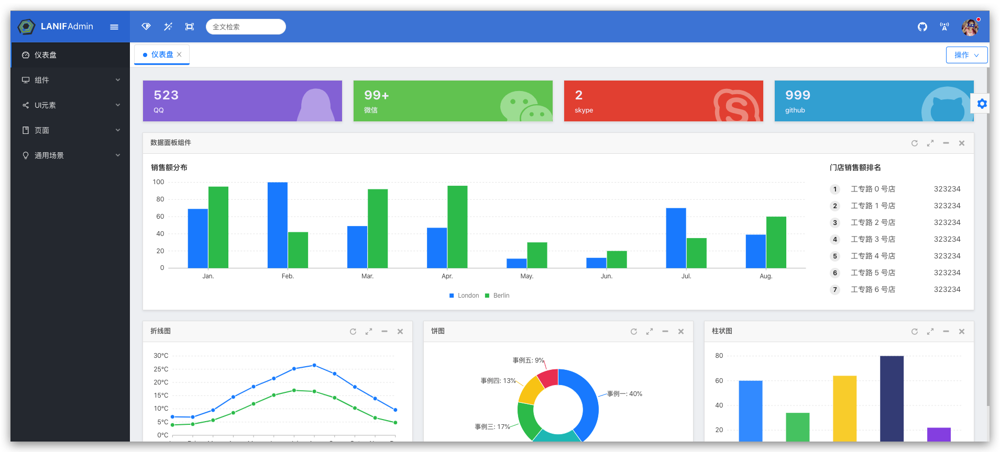

English | [中文文档](https://docs.nestify.cn/)

# Nestify
[](https://lerna.js.org/) [](http://makeapullrequest.com) [](https://github.com/ZhiXiao-Lin/nestify) [](https://github.com/ZhiXiao-Lin/nestify/fork)

[](http://docs.nestify.cn/)

A enterprise web fullstack framework based on Nest.js

### Preview
[](http://docs.nestify.cn/)

### Use

``` shell
# Clone code
$ git clone git@github.com:ZhiXiao-Lin/nestify.git --depth=1

# Install dependencies
$ docker-compose up -d

# Run service
$ cd apps/service && yarn && yarn start:dev

# Run admin
$ cd apps/admin && yarn && yarn start

# Run applet
$ cd apps/applet && yarn && yarn dev:h5

# Run docs
$ cd apps/docs && yarn && yarn start

```

### Features & Roadmap
- [x] Config
- [x] Cache
- [x] Logger
- [x] Event Bus
- [x] Workflow Engine
- [x] Rule Engine 
- [x] Mailer
- [x] Verification
- [x] Console
- [x] MongoDB Seeder
- [ ] Task Queue
- [ ] Search Engine
- [ ] Notification
- [ ] Cashier
- [ ] Storage
- [ ] OAuth
- [ ] Broadcast
- [ ] Cube
- [ ] SSR

### Stay in touch

* Author - [Roy Lin](https://github.com/ZhiXiao-Lin)
* Gmail - [linzhixiao1996@gmail.com](mailto://linzhixiao1996@gmail.com)

### License

Nestify is [MIT licensed](https://github.com/ZhiXiao-Lin/nestify/tree/c25b47543f09dc142f7ba7a44078da8d13f9bed0/LICENSE/README.md).

### Support

Any feedback (use, pull request, issue, watch, star, fork) is considered as support for the project.

<!-- ## Contributors

### Code Contributors

This project exists thanks to all the people who contribute. [[Contribute](CONTRIBUTING.md)].
<a href="https://github.com/ZhiXiao-Lin/nestify/graphs/contributors"></a>

### Financial Contributors

Become a financial contributor and help us sustain our community. [[Contribute](https://opencollective.com/nestify/contribute)]

#### Individuals

<a href="https://opencollective.com/nestify"></a>

#### Organizations

Support this project with your organization. Your logo will show up here with a link to your website. [[Contribute](https://opencollective.com/nestify/contribute)]

<a href="https://opencollective.com/nestify/organization/0/website"></a>
<a href="https://opencollective.com/nestify/organization/1/website"></a>
<a href="https://opencollective.com/nestify/organization/2/website"></a>
<a href="https://opencollective.com/nestify/organization/3/website"></a>
<a href="https://opencollective.com/nestify/organization/4/website"></a>
<a href="https://opencollective.com/nestify/organization/5/website"></a>
<a href="https://opencollective.com/nestify/organization/6/website"></a>
<a href="https://opencollective.com/nestify/organization/7/website"></a>
<a href="https://opencollective.com/nestify/organization/8/website"></a>
<a href="https://opencollective.com/nestify/organization/9/website"></a> -->
